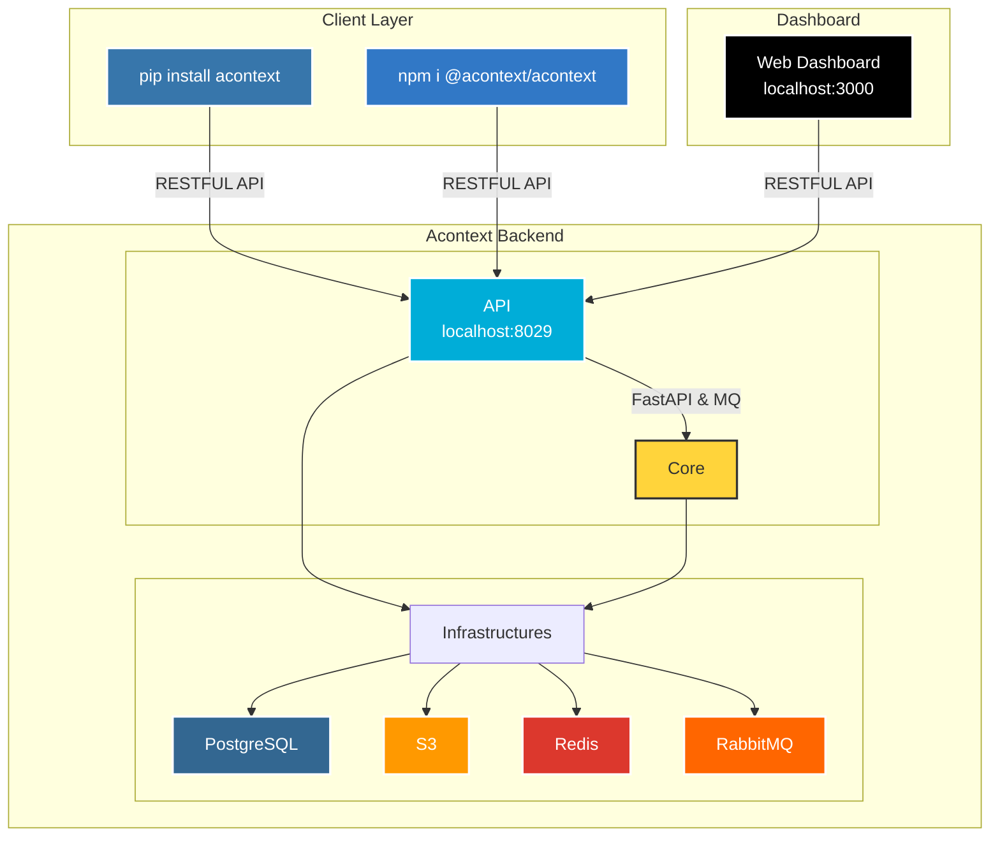
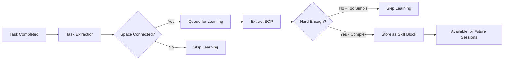

# GitHub - memodb-io/Acontext: Data platform for context engineering. Context data platform that stores, observes and learns. Join the community❤️: https://discord.acontext.io

## Summary

Data platform for context engineering. Context data platform that stores, observes and learns. Join the community❤️: https://discord.acontext.io - memodb-io/Acontext

**Category:** `Code Repository`  

**Tags:** `code` `github`

**Source:** [https://github.com/memodb-io/Acontext](https://github.com/memodb-io/Acontext)

---

## Content

Repository: memodb-io/Acontext
Description: Data platform for context engineering. Context data platform that stores, observes and learns. Join the community❤️: https://discord.acontext.io

Topics: agent, agent-development-kit, agent-observability, ai-agent, anthropic, context-data-platform, context-engineering, data-platform, llm, llm-observability, llmops, memory, openai, self-evolving, self-learning

⭐ Stars: 2178
Language: Go

README:

<div align="center">
  <a href="https://discord.acontext.io">
      
  </a>
  <p>
    <h4>Context Data Platform for Building Cloud-native AI Agents</h4>
  </p>
  <p align="center">
    <a href="https://pypi.org/project/acontext/"></a>
    <a href="https://www.npmjs.com/package/@acontext/acontext"></a>
    <a href="https://github.com/memodb-io/acontext/actions/workflows/core-test.yaml"></a>
    <a href="https://github.com/memodb-io/acontext/actions/workflows/api-test.yaml"></a>
    <a href="https://github.com/memodb-io/acontext/actions/workflows/cli-test.yaml"></a>
  </p>
  <p align="center">
    <a href="https://x.com/acontext_io"></a>
    <a href="https://discord.acontext.io"></a>
  </p>
  <div align="center">
    <!-- Keep these links. Translations will automatically update with the README. -->
    <a href="./readme/de/README.md">Deutsch</a> | 
    <a href="./readme/es/README.md">Español</a> | 
    <a href="./readme/fr/README.md">Français</a> | 
    <a href="./readme/ja/README.md">日本語</a> | 
    <a href="./readme/ko/README.md">한국어</a> | 
    <a href="./readme/pt/README.md">Português</a> | 
    <a href="./readme/ru/README.md">Русский</a> | 
    <a href="./readme/zh/README.md">中文</a>
  </div>
  <br/>
</div>

Acontext can help you:

- **Build a scalable agent with better context engineering**
- **Observe your agent success rate**
- **Improve your agent with self-learning for each user**


<div align="center">
    <picture>
      
    </picture>
  <p>Context Data Platform that Store, Observe and Learn</p>
</div>


# 💡 Core Features

- **Context Engineering**
  - [Session](https://docs.acontext.io/store/messages/multi-provider): unified message storage for any llm, any modal.
  - [Disk](https://docs.acontext.io/store/disk): save/download artifacts with file path.
  - [Context Editing](https://docs.acontext.io/store/editing) - manage your context window in one api.

<div align="center">
    <picture>
      
    </picture>
  <p>Context Engineering in Acontext</p>
</div>

- **Observe agent tasks and user feedback**
  - [Task](https://docs.acontext.io/observe/agent_tasks): collect agent's working status, progress and preferences in near real-time.
- **Agent self-learning**
  - [Experience](https://docs.acontext.io/learn/advance/experience-agent): let agent learns SOPs for each user.
- **View everything in one [dashboard](https://docs.acontext.io/observe/dashboard)**

<div align="center">
    <picture>
      
    </picture>
  <p>Dashboard of Agent Success Rate and Other Metrics</p>
</div>


# 🏗️ How it works?

<details>
<summary>click to open</summary>



## How They Work Together

```txt
┌──────┐    ┌────────────┐    ┌──────────────┐    ┌───────────────┐
│ User │◄──►│ Your Agent │◄──►│   Session    │    │ Artifact Disk │
└──────┘    └─────▲──────┘    └──────┬───────┘    └───────────────┘
                  │                  │ # if enable
                  │         ┌────────▼────────┐
                  │         │ Observed Tasks  │
                  │         └────────┬────────┘
                  │                  │ # if enable
                  │         ┌────────▼────────┐
                  │         │   Learn Skills  │
                  │         └────────┬────────┘
                  └──────────────────┘
                      Search skills
```


## Data Structures

<details>
<summary>📖 Task Structure</summary>

```json
{
  "task_description": "Star https://github.com/memodb-io/Acontext",
  "progresses": [
    "I have navigated to Acontext repo",
    "Tried to Star but a pop-up required me to login",
    ...
  ],
  "user_preferences": [
    "user wants to use outlook email to login"
  ]
}
```
</details>


<details>
<summary>📖 Skill Structure</summary>


```json
{
    "use_when": "star a repo on github.com",
    "preferences": "use user's outlook account",
    "tool_sops": [
        {"tool_name": "goto", "action": "goto github.com"},
        {"tool_name": "click", "action": "find login button if any. login first"},
        ...
    ]
}
```

</details>


<details>
<summary>📖 Space Structure</summary>

```txt
/
└── github/ (folder)
    └── GTM (page)
        ├── find_trending_repos (sop)
        └── find_contributor_emails (sop)
    └── basic_ops (page)
        ├── create_repo (sop)
        └── delete_repo (sop)
    ...
```
</details>

</details>


# 🚀 Start the Backend Locally

We have an `acontext-cli` to help you do quick proof-of-concept. Download it first in your terminal:

```bash
curl -fsSL https://install.acontext.io | sh
```

You should have [docker](https://www.docker.com/get-started/) installed and an OpenAI API Key to start an Acontext backend on your computer:

```bash
mkdir acontext_server && cd acontext_server
acontext docker up
```

> [!IMPORTANT]
>
> Make sure your LLM has the ability to [call tools](https://platform.openai.com/docs/guides/function-calling). By default, Acontext will use `gpt-4.1`.

`acontext docker up` will create/use  `.env` and `config.yaml` for Acontext, and create a `db` folder to persist data.


Once it's done, you can access the following endpoints:

- Acontext API Base URL: http://localhost:8029/api/v1
- Acontext Dashboard: http://localhost:3000/


# 🧐 Use Acontext to build Agent

Download end-to-end scripts with `acontext`:

**Python**

```bash
acontext create my-proj --template-path "python/openai-basic"
```

> More examples on Python:
>
> - `python/openai-agent-basic`: self-learning agent in openai agent sdk.
> - `python/agno-basic`: self-learning agent in agno frameworkd.
> - `python/openai-agent-artifacts`: agent that can edit and download artifacts.

**Typescript**

```bash
acontext create my-proj --template-path "typescript/openai-basic"
```

> More examples on Typescript:
>
> - `typescript/vercel-ai-basic`: self-learning agent in @vercel/ai-sdk


> [!NOTE]
>
> Check our example repo for more templates: [Acontext-Examples](https://github.com/memodb-io/Acontext-Examples).
>
> We're cooking more full-stack Agent Applications! [Tell us what you want!](https://discord.acontext.io)


## Step-by-step Quickstart

<details>
<summary>click to open</summary>


We're maintaining Python [](https://pypi.org/project/acontext/) and Typescript [](https://www.npmjs.com/package/@acontext/acontext) SDKs. The snippets below are using Python.

## Install SDKs

```
pip install acontext # for Python
npm i @acontext/acontext # for Typescript
```


## Initialize Client

```python
from acontext import AcontextClient

client = AcontextClient(
    base_url="http://localhost:8029/api/v1",
    api_key="sk-ac-your-root-api-bearer-token"
)
client.ping()

# yes, the default api_key is sk-ac-your-root-api-bearer-token
```

> [📖 async client doc](https://docs.acontext.io/settings/core)


## Store

Acontext can manage agent sessions and artifacts.

### Save Messages [📖](https://docs.acontext.io/api-reference/session/store-message-to-session)

Acontext offers persistent storage for message data. When you call `session.store_message`, Acontext will persist the message and start to monitor this session:

<details>
<summary>Code Snippet</summary>

```python
session = client.sessions.create()

messages = [
    {"role": "user", "content": "I need to write a landing page of iPhone 15 pro max"},
    {
        "role": "assistant",
        "content": "Sure, my plan is below:\n1. Search for the latest news about iPhone 15 pro max\n2. Init Next.js project for the landing page\n3. Deploy the landing page to the website",
    }
]

# Save messages
for msg in messages:
    client.sessions.store_message(session_id=session.id, blob=msg, format="openai")
```

> [📖](https://docs.acontext.io/store/messages/multi-modal) We also support multi-modal message storage and anthropic SDK.


</details>

### Load Messages [📖](https://docs.acontext.io/api-reference/session/get-messages-from-session)

Obtain your session messages using `sessions.get_messages`

<details>
<summary>Code Snippet</summary>

```python
r = client.sessions.get_messages(session.id)
new_msg = r.items

new_msg.append({"role": "user", "content": "How are you doing?"})
r = openai_client.chat.completions.create(model="gpt-4.1", messages=new_msg)
print(r.choices[0].message.content)
client.sessions.store_message(session_id=session.id, blob=r.choices[0].message)
```

</details>

<div align="center">
    <picture>
      
    </picture>
  <p>You can view sessions in your local Dashboard</p>
</div>


### Artifacts [📖](https://docs.acontext.io/store/disk)

Create a disk for your agent to store and read artifacts using file paths:

<details>
<summary>Code Snippet</summary>

```python
from acontext import FileUpload

disk = client.disks.create()

file = FileUpload(
    filename="todo.md",
    content=b"# Sprint Plan\n\n## Goals\n- Complete user authentication\n- Fix critical bugs"
)
artifact = client.disks.artifacts.upsert(
    disk.id,
    file=file,
    file_path="/todo/"
)


print(client.disks.artifacts.list(
    disk.id,
    path="/todo/"
))

result = client.disks.artifacts.get(
    disk.id,
    file_path="/todo/",
    filename="todo.md",
    with_public_url=True,
    with_content=True
)
print(f"✓ File content: {result.content.raw}")
print(f"✓ Download URL: {result.public_url}")        
```
</details>


<div align="center">
    <picture>
      
    </picture>
  <p>You can view artifacts in your local Dashboard</p>
</div>


## Observe [📖](https://docs.acontext.io/observe)

For every session, Acontext will **automatically** launch a background agent to track the task progress and user feedback. **It's like a background TODO agent**. Acontext will use it to observe your daily agent success rate.

You can use the SDK to retrieve the current state of the agent session, for Context Engineering like Reduction and Compression. 

<details>
<summary>Full Script</summary>

```python
from acontext import AcontextClient

# Initialize client
client = AcontextClient(
    base_url="http://localhost:8029/api/v1", api_key="sk-ac-your-root-api-bearer-token"
)

# Create a project and session
session = client.sessions.create()

# Conversation messages
messages = [
    {"role": "user", "content": "I need to write a landing page of iPhone 15 pro max"},
    {
        "role": "assistant",
        "content": "Sure, my plan is below:\n1. Search for the latest news about iPhone 15 pro max\n2. Init Next.js project for the landing page\n3. Deploy the landing page to the website",
    },
    {
        "role": "user",
        "content": "That sounds good. Let's first collect the message and report to me before any landing page coding.",
    },
    {
        "role": "assistant",
        "content": "Sure, I will first collect the message then report to you before any landing page coding.",
      	"tool_calls": [
            {
                "id": "call_001",
                "type": "function",
                "function": {
                    "name": "search_news",
                    "arguments": "{\"query\": \"iPhone news\"}"
                }
            }
        ]
    },
]

# Store messages in a loop
for msg in messages:
    client.sessions.store_message(session_id=session.id, blob=msg, format="openai")

# Wait for task extraction to complete
client.sessions.flush(session.id)

# Display extracted tasks
tasks_response = client.sessions.get_tasks(session.id)
print(tasks_response)
for task in tasks_response.items:
    print(f"\nTask #{task.order}:")
    print(f"  ID: {task.id}")
    print(f"  Title: {task.data.task_description}")
    print(f"  Status: {task.status}")

    # Show progress updates if available
    if task.data.progresses:
        print(f"  Progress updates: {len(task.data.progresses)}")
        for progress in task.data.progresses:
            print(f"    - {progress}")

    # Show user preferences if available
    if task.data.user_preferences:
        print("  User preferences:")
        for pref in task.data.user_preferences:
            print(f"    - {pref}")

```
> `flush` is a blocking call, it will wait for the task extraction to complete.
> You don't need to call it in production, Acontext has a [buffer mechanism](https://docs.acontext.io/observe/buffer) to ensure the task extraction is completed right on time.

</details>

Example Task Return:

```txt
Task #1:
  Title: Search for the latest news about iPhone 15 Pro Max and report findings to the user before any landing page coding.
  Status: success
  Progress updates: 2
    - I confirmed that the first step will be reporting before moving on to landing page development.
    - I have already collected all the iPhone 15 pro max info and reported to the user, waiting for approval for next step.
  User preferences:
    - user expects a report on latest news about iPhone 15 pro max before any coding work on the landing page.

Task #2:
  Title: Initialize a Next.js project for the iPhone 15 Pro Max landing page.
  Status: pending

Task #3:
  Title: Deploy the completed landing page to the website.
  Status: pending
```


You can view the session tasks' statuses in the Dashboard:

<div align="center">
    <picture>
      
    </picture>
  <p>A Task Demo</p>
</div>


## Self-learning

Acontext can gather a bunch of sessions and learn skills (SOPs) on how to call tools for certain tasks.

### Learn Skills to a `Space` [📖](https://docs.acontext.io/learn/skill-space)

<div align="center">
    <picture>
      
    </picture>
  <p>How self-learning works?</p>
</div>

A `Space` can store skills, and memories in a Notion-like system. You first need to connect a session to `Space` to enable the learning process:

```python
# Step 1: Create a Space for skill learning
space = client.spaces.create()
print(f"Created Space: {space.id}")

# Step 2: Create a session attached to the space
session = client.sessions.create(space_id=space.id)

# ... push the agent working context
```

The learning happens in the background and is not real-time (delay around 10-30s). 

What Acontext will do in the background:



Eventually, SOP blocks with tool-call pattern will be saved to `Space`. You can view every `Space` in the Dashboard:

<div align="center">
    <picture>
      
    </picture>
  <p>A Space Demo</p>
</div>


### Search Skills from a `Space` [📖](https://docs.acontext.io/learn/search-skills)

To search skills from a `Space` and use them in the next session:

```python
result = client.spaces.experience_search(
    space_id=space.id,
    query="I need to implement authentication",
  	mode="fast"
)
```

Acontext supports `fast` and `agentic` modes for search. The former uses embeddings to match skills. The latter uses an Experience Agent to explore the entire `Space` and tries to cover every skill needed.

The return is a list of sop blocks, which look like below:

```json
{
    "use_when": "star a github repo",
    "preferences": "use personal account. star but not fork",
    "tool_sops": [
        {"tool_name": "goto", "action": "goto the user given github repo url"},
        {"tool_name": "click", "action": "find login button if any, and start to login first"},
        ...
    ]
}
```

</details>


# 🔍 Document

To understand what Acontext can do better, please view [our docs](https://docs.acontext.io/)


# ❤️ Stay Updated

Star Acontext on Github to support and receive instant notifications 


# 🤝 Stay Together

Join the community for support and discussions:

-   [Discuss with Builders on Acontext Discord](https://discord.acontext.io) 👻 
-  [Follow Acontext on X](https://x.com/acontext_io) 𝕏 


# 🌟 Contributing

- Check our [roadmap.md](./ROADMAP.md) first.
- Read [contributing.md](./CONTRIBUTING.md)


# 📑 LICENSE

This project is currently licensed under [Apache License 2.0](LICENSE).


# 🥇 Badges

 

```md
[](https://acontext.io)

[](https://acontext.io)
```
